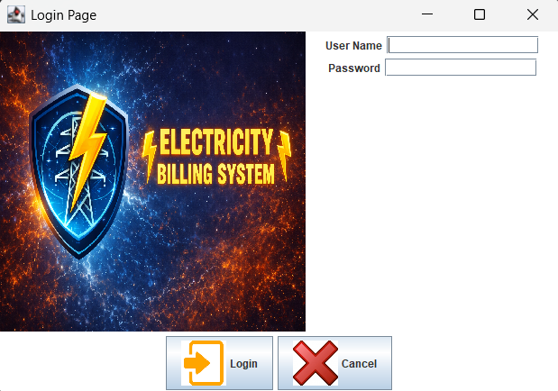
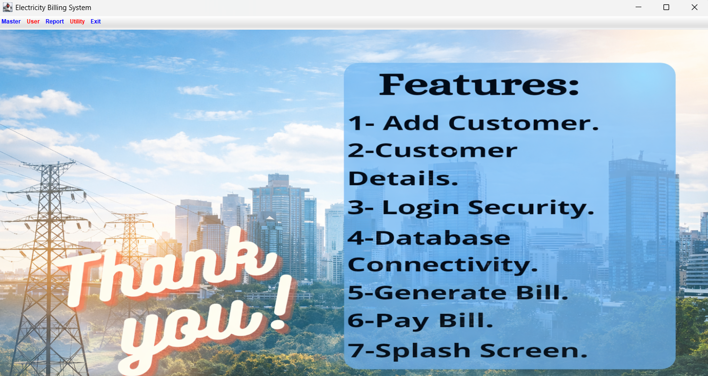
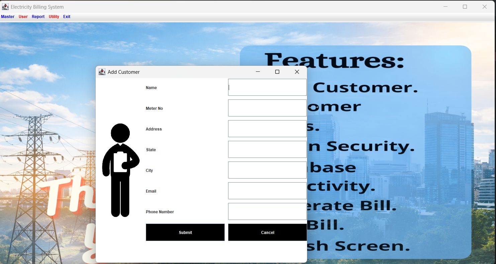

# ⚡ Electricity Billing System

This is a **Java-based GUI application** for managing electricity billing operations. It supports user login, customer registration, bill generation, payment processing, and more — all built using **Java Swing** and **MySQL (JDBC)**.

👨‍💻 Developed by **Sujal Chouksey**
🛠 IDE Used: IntelliJ IDEA
💾 Database: MySQL
📚 Libraries: JDBC (MySQL Connector/J)

---

# ✨ Features

* 🔐 User login system for secure access
* 👤 Add and manage customer details
* 📊 Generate electricity bills
* 💸 Pay bills
* 🧾 View last bill
* 📄 View customer details
* 🗄 MySQL database integration
* 🖼️ Interactive Swing GUI

---

# 🗂️ Project Structure

```
Splash.java          → Splash screen
Login.java           → User login
Project.java         → Main dashboard
new_customer.java    → Add customer
customer_details.java→ Customer details
generate_bill.java   → Generate bill
pay_bill.java        → Pay bill
LastBill.java        → Last bill view
conn.java            → Database connection
```

---

# 🛢️ Database Schema (MySQL)

Create database:

```sql
CREATE DATABASE electricity_db;
USE electricity_db;
```

### Login Table

| username | password |
| -------- | -------- |

### Emp Table

| name | meter_number | address | state | city | email | phone |

### Bill Table

| meter_number | units | month | amount |

### Tax Table

| meter_location | meter_type | phase_code | bill_type | days | meter_rent | mcb_rent | service_rent | gst |

---

# 🔧 Technologies Used

* Java (JDK 8+)
* Java Swing (GUI)
* JDBC (Database Connectivity)
* MySQL (Database)
* IntelliJ IDEA (IDE)

---

# 📸 Application Screenshots

## 🔐 Login Screen



## 🏠 Main Dashboard



## 💳 Pay Bill



## ⚡ Generate Bill


## 📋 Customer Details


## 🧾 Calculate Bill


## ➕ Add Customer


---

# 🚀 How to Run

### 1 Clone repository

```
git clone https://github.com/sujal-09/Electricity-billing-system.git
```

### 2 Open in IntelliJ / Eclipse

Open project folder

### 3 Setup MySQL

Update credentials inside:

```
conn.java
```

```
Connection c = DriverManager.getConnection(
"jdbc:mysql:///electricity_db",
"root",
"password"
);
```

### 4 Run Project

Run:

```
Splash.java
```

OR

```
Project.java
```

---

# 🎯 Resume Description

Developed a Java Swing-based Electricity Billing System with MySQL integration supporting customer management, bill generation, and payment processing. Implemented JDBC connectivity, authentication system, and interactive GUI for efficient billing workflow.

---

# ⭐ Show Your Support

If you like this project, give it a ⭐ on GitHub.
